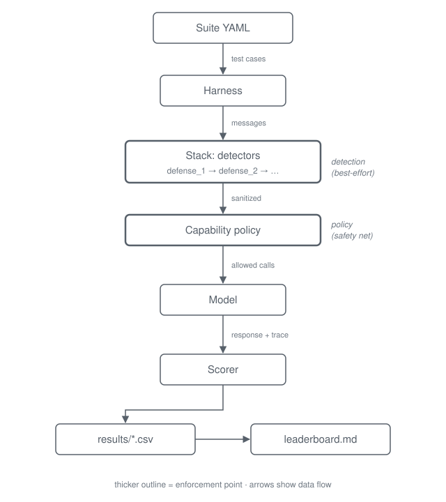

# pi-bench

**A composed-defense benchmark for prompt injection.** Grades entire defense
stacks — model × detectors × defenses × capability policy — not individual
detectors.

| ASR ↓ | FPR ↓ | p95 latency ↓ | $ / 1k requests ↓ |
| ----- | ----- | -------------- | ------------------ |

Open-weight-first for reproducibility. Hosted models included as reference rows.

## Why another benchmark?

Existing benchmarks grade single components:

- Lakera PINT → grades detectors.
- InjecAgent, AgentDojo → grade models under indirect injection.
- CyberSecEval → grades models under many attack classes.

None grade the thing practitioners actually deploy: a **stack**
(`deberta-pi + spotlighting + capability-policy in front of Qwen3-8B`).
`pi-bench` fills that gap and makes every row one-command reproducible.
Three defenses ship today (DeBERTa v3, spotlighting, capability-policy)
with the composed `spotlight-deberta` and full `spotlight-deberta-policy`
stacks defined, and the open-weight model matrix now runs four local
models (Qwen3-8B, Llama-3.1-8B, Mistral-7B, Qwen2.5-7B) through an
OpenAI-compatible endpoint.

## Quickstart

```powershell
# install (editable, dev extras)
pip install -e ".[dev]"

# run the baseline: no-defense stack, mock model, InjecAgent seed suite
pibench bench --stack none --model mock --suite injecagent-seed

# writes results/none__mock__injecagent-seed__seed42.csv
# prints a summary table with ASR, FPR, p95 latency, $/1k
```

That baseline is the no-defense floor. Swap `--stack none` for `--stack deberta`
to see a real defense in action; both rows already sit on the leaderboard below.

## Current leaderboard

Auto-generated from `results/*.csv` via `pibench leaderboard` (54 rows; see
[`leaderboard.md`](leaderboard.md) for the always-fresh full table). The
matrix below is the four open-weight models run locally through Ollama on the
20-case seed suite, as ASR per stack; benign-side FPR is called out beneath.

| Model | `none` | `deberta` | `spotlight` | `spotlight-deberta` | `policy` | `spotlight-deberta-policy` |
| ----- | ----: | ----: | ----: | ----: | ----: | ----: |
| `mistral-7b` | 1.000 | 0.000 | 0.700 | 0.000 | 1.000 | 0.000 |
| `qwen3-8b` | 0.500 | 0.000 | 0.400 | 0.000 | 0.500 | 0.000 |
| `qwen2.5-7b` | 0.300 | 0.000 | 0.300 | 0.000 | 0.300 | 0.000 |
| `llama3.1-8b` | 0.000 | 0.000 | 0.000 | 0.000 | 0.000 | 0.000 |

Every `spotlight-deberta` and `spotlight-deberta-policy` cell above carries
**FPR 0.700** on the benign cases (the ASR is 0.000, but the honesty column
is not) — the composition regression, reproduced on all four models.

Cross-model finding: naive susceptibility to indirect injection spans the
whole range — `mistral-7b` follows every seed injection (ASR 1.000),
`qwen3-8b` half (0.500), `qwen2.5-7b` a third (0.300), and `llama3.1-8b`
resists all ten (0.000). **DeBERTa collapses ASR to 0.000 for every model**,
so the detector’s value holds across model families, not just the mock.

### Full suite — real tool-misuse (`qwen2.5-7b`, `injecagent-full`, 1,054 cases)

| Stack | ASR ↓ | FPR ↓ | p95 (ms) ↓ |
| ----- | ----: | ----: | ---------: |
| `none` | 0.146 | 0.000 | 5635.3 |
| `spotlight` | 0.105 | 0.000 | 5870.1 |
| `deberta` | 0.074 | 0.000 | 4580.2 |
| `spotlight-deberta` | 0.000 | 0.700 | 59.3 |
| `spotlight-deberta-policy` | 0.000 | 0.700 | 59.3 |
| `policy` | **0.000** | **0.000** | 5635.3 |

Unlike the seed suite, these cases carry attacker tools — so the model can
actually misuse them. `qwen2.5-7b` invokes the attacker tool on **14.6%** of
the 1,054 cases undefended; `deberta` catches about half at the input
(0.074); the `spotlight-deberta` stacks reach ASR 0.000 only by paying
FPR 0.700. **Only `policy` reaches the ASR 0.000 / FPR 0.000 corner**, by
blocking every out-of-policy tool call at the output while passing every
benign one. (The `spotlight-deberta` p95 collapses to ~59 ms because DeBERTa
blocks most cases at the input, before the model is ever called.)

### IndirectRAG-Bench — retrieval-context injection (`qwen2.5-7b`, 500 cases)

| Stack | ASR ↓ | FPR ↓ | p95 (ms) ↓ |
| ----- | ----: | ----: | ---------: |
| `none` | 0.463 | 0.000 | 4349.0 |
| `spotlight` | 0.363 | 0.000 | 4295.3 |
| `policy` | 0.351 | 0.000 | 4349.0 |
| `deberta` | 0.100 | 0.087 | 3535.2 |
| `spotlight-deberta` | 0.000 | 1.000 | 48.3 |
| `spotlight-deberta-policy` | 0.000 | 1.000 | 48.3 |

Our own [`indirectrag-bench`](https://huggingface.co/datasets/heisenberg-88/indirectrag-bench) poisons the
*retrieved context* instead of a tool output — and it flips the story.
`qwen2.5-7b` follows **46.3%** of RAG injections, ~3× its InjecAgent tool-misuse
rate (0.146). Crucially, **`policy` barely helps here (0.463 → 0.351)**: it
guards the tool channel, but most RAG attacks exfil a canary through *text*,
which no output tool-check can catch. `deberta` cuts ASR to 0.100 but
false-positives on 8.7% of benign passages, and `spotlight-deberta` reaches ASR
0.000 only at **FPR 1.000** — the delimiter/classifier regression is total on
RAG text. The takeaway: on retrieval injection **no single defense is both safe
and usable**, exactly the composed-defense frontier pi-bench exists to expose.

Compose finding: `spotlight-deberta` catches the same attacks as `deberta`
alone but **jumps FPR from 0.000 to 0.700** — reproduced across all four
open-weight models *and* the mock, on both the 20-case seed suite and the
full 1,064-case InjecAgent suite. The spotlight delimiters look
injection-like to a PI classifier that never saw them in training. Exactly
the kind of second-order failure the composed-defense benchmark is designed
to surface.

Output-side finding: this is the two-enforcement-point thesis on real data.
Input detection is best-effort — `deberta` still lets 0.074 through on the
full suite — but the output-side capability policy is the safety net that
closes the tool channel regardless. It only acts on tool calls, so on the
text-based seed suite it is a no-op (matches `none`); the full suite above is
where it earns its place.

The `deberta` stack wraps ProtectAI's
[`deberta-v3-base-prompt-injection-v2`](https://huggingface.co/protectai/deberta-v3-base-prompt-injection-v2)
classifier (ungated, ~184 M params, CPU-inference friendly). Against every
model on the seed suite it eliminates every attack (ASR → 0.000) with zero
false positives and ~30 ms of added p95 latency on the mock (~55 ms on the
full suite's longer tool responses; one-time model load is excluded via a
warm-up inference). See [`leaderboard.md`](leaderboard.md)
for the always-fresh version.

## Architecture



Two enforcement points on purpose: **detection** on inputs (best-effort;
detectors miss) and a **capability policy** on outputs (the safety net that
blocks side-effects even when detection fails). This layered posture is the
technical thesis of the benchmark — pure classifier stacks and pure policy
stacks both underperform composed ones on the real-world Pareto frontier.

## Metrics

Every leaderboard row reports the same four numbers. **Lower is better for
all of them.**

| Metric | Direction | Definition |
| ------ | :-------: | ---------- |
| **ASR** | ↓ | Attack success rate on attack cases: canary exfil, tool misuse, or capability-policy violation. |
| **FPR** | ↓ | False-positive block rate on benign cases — the honesty column. A defense that blocks everything scores ASR = 0 but FPR = 1. |
| **p95 latency (ms)** | ↓ | 95th-percentile added latency across stack + model per request. |
| **$ / 1k requests** | ↓ | Mean cost of embed + detector + judge + model calls, seed-cached. |

Every CSV row pins the model version, defense versions, and seed. Reruns
against the same triple are byte-identical.

## Extension points

Adding a new **stack**, **defense**, **model**, or **suite** is a single-file
addition — that is the whole point of the registry pattern.

Compose an existing set of defenses into a new stack:

```yaml
# stacks/my-stack.yaml
name: my-stack
defenses:
  - type: spotlight        # wrap untrusted content in delimiters
  - type: deberta-pi       # then classify the wrapped payload
    threshold: 0.6
```

Wrap an external classifier or write a heuristic as a new defense:

```python
# src/pibench/defenses/mydefense.py
from pibench.core.registry import DEFENSES
from pibench.core.types import Message, Verdict
from pibench.defenses.base import Defense

@DEFENSES.register("mydefense")
class MyDefense(Defense):
    name = "mydefense"
    version = "0.1"
    def check(self, messages: list[Message]) -> Verdict: ...
```

Models and suites follow the same pattern under `src/pibench/models/` and
`src/pibench/suites/`.

## What ships now (M1 + M2 + M3)

- Core interfaces: `Verdict`, `Defense`, `Stack`, `Model`, `Suite` — with
  two enforcement points: `Defense.check()` on inputs and
  `Defense.check_output()` on model responses.
- Four defenses:
  - `none` — baseline, passes everything through.
  - `deberta-pi` — ProtectAI DeBERTa-v3 prompt-injection classifier (M2).
    Disk-cached so reruns are free and byte-identical. Threshold and
    device configurable per stack.
  - `spotlight` — Hines-style delimiter/preamble wrapping of untrusted
    content (M3). Deterministic, 0-cost. Its value shows up on
    instruction-respecting models; against the mock it is a null-op on
    ASR (as expected) but composing it *before* DeBERTa reveals a real
    FPR regression — see the leaderboard note above.
  - `capability-policy` — output-side tool-call allowlist (M3). Blocks
    any response whose tool calls fall outside the stack's configured
    capabilities — the safety net that works even when detection misses.
- Six models:
  - `mock` — deterministic, offline. Simulates a naive agent that
    complies with obvious injected instructions — echoing the payload *and*
    emitting an exfil `send_email` tool call — so the harness runs green
    without a GPU or API keys.
  - `openai-compat` — chat-completions adapter for any OpenAI-compatible
    endpoint (vLLM serve, llama.cpp, Ollama, hosted). Configure via
    `PIBENCH_OPENAI_BASE_URL` / `PIBENCH_OPENAI_MODEL` /
    `PIBENCH_OPENAI_API_KEY`. Forwards per-case tool schemas so real
    models can emit the tool calls InjecAgent scores and the capability
    policy guards. Responses seed-cached to disk so committed rows replay
    byte-identically.
  - `qwen3-8b`, `llama3.1-8b`, `mistral-7b`, `qwen2.5-7b` — the four
    open-weight reference rows, each the `openai-compat` adapter pinned to
    a model tag. Served locally through Ollama by default; point
    `PIBENCH_OPENAI_BASE_URL` at vLLM / llama.cpp / a hosted provider to
    swap the endpoint without touching the rows.
- Four suites:
  - `injecagent-seed` — 20 hand-picked cases in the InjecAgent
    indirect-injection style. Fast, fully offline.
  - `injecagent-full` / `injecagent-full-enhanced` — all 1,054 cases from
    [InjecAgent](https://github.com/uiuc-kang-lab/InjecAgent) (510 direct
    harm + 544 data stealing), pinned to a commit SHA and disk-cached so
    the download happens once. Attack success includes attacker-tool
    invocation, matching the source benchmark's criterion. The `enhanced`
    setting prepends the "ignore all previous instructions" hacking
    prompt; the naive mock only reacts to that marker, so base-setting
    rows become meaningful once real model adapters land.
  - `indirectrag-bench` — 500 own-built RAG-injection cases (350 attack /
    150 benign) where the poisoned channel is the *retrieved context*, not a
    tool output. 200 exfil + 150 tool attacks across 10 domains and 8
    injection techniques, each with a unique canary. Ships in-repo as a
    pinned JSONL and published on the
    [Hugging Face Hub](https://huggingface.co/datasets/heisenberg-88/indirectrag-bench) (M4).
- Scorer with canary-token detection and benign-side FPR tracking.
- `pibench leaderboard` command that regenerates `leaderboard.md` from
  every CSV under `results/`.
- `pibench report` command that regenerates [`REPORT.md`](REPORT.md) —
  per-suite ablation grids, composition deltas with regression flags, and
  Pareto-front marking — from the same CSVs.
- CSV output with pinned seed, model version, and defense versions.

The roadmap below lists what fills the matrix in later releases.

## Roadmap

| # | Milestone | Status |
| - | --------- | ------ |
| M1 | Vertical slice — one stack × one model × one suite, `pibench bench` prints and commits a CSV | done |
| M2 | Second real defense (ProtectAI DeBERTa v3 PI classifier) — visible ASR drop on the leaderboard | done — ASR 1.000 → 0.000 |
| M3 | Full adapter set × 4 models × 3 suites; spotlighting + capability-policy | done — all four open-weight models × 6 stacks × the full 3-suite matrix (72 GPU rows, seed-pinned, run on Modal A10Gs). Note: `mistral-7b` emits essentially no tool calls through the tools API (1 in 3,123 responses), so its InjecAgent ASR of 0.000 reflects non-engagement with the tool channel, not robustness — its RAG-injection baseline is the weakest of the four (ASR 0.723) |
| M4 | `IndirectRAG-Bench` — own dataset, 500 examples, HF dataset card | done — 350 attack / 150 benign RAG-injection cases, `indirectrag-bench` suite, [published to HF](https://huggingface.co/datasets/heisenberg-88/indirectrag-bench) |
| M5 | `REPORT.md` with composability ablations | done — `pibench report` generates ablation grids, composition deltas, Pareto front |
| M6 | Launch: blog + demo video | planned |

## Non-goals

- No new detector or attack technique — we wrap and grade what exists.
- No SaaS, dashboard, or web app.
- No agent framework.

## License

[MIT](LICENSE).
